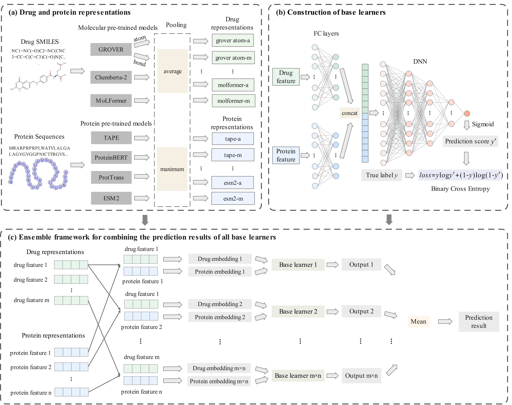

EDeepDTI：A scalable and robust ensemble deep learning method for predicting drug-target interactions
====

1' The environment of EDeepDTI
===
 python = 3.8.19 
 cudatoolkit = 11.8.0 
 cudnn = 8.9.2.26 
 pytorch = 2.2.2 
 scikit-learn = 1.3.0 
 pandas = 2.0.3 
 numpy = 1.24.3 
 sqlalchemy = 2.0.30 

2' Usage
===
（1）Run `EDeepDTI.py` for DrugBank dataset, run `EDeepDTI_CPI.py` for CPI dataset, run `EDeepDTI_Davis_KIBA.py` for Davis and KIBA datasets  
（2） For EDeepDTI, input_type = 'e'; for EDeepDTI-d, input_type = 'd'; for EDeepDTI-s, input_type = 's'. 
（3） For prediction task SR, predict_type = '5_fold'; for task SD, predict_type = 'new_drug'; for task SP, predict_type = 'new_protein'; for task SDP, predict_type = 'new_drug_protein'. 
（4） For grid search for hyperparameters, run `EDeepDTI_GridSearchCV.py` to determine the values of hyperparameters, run `EDeepDTI_GridSearchCV_epoch.py` to determine the number of epochs. 
（5） Run `EDeepDTI_10fold.py` to get the prediction scores of all drug-protein pairs on the DrugBank dataset.

3' Code and data
===
3.1  Raw data (datasets_DTI/origin_data)
------
##### BingdingDB
`BdingdingDB_ALl_202401.tsv` (compound-protein binding affinity) were downloaded from 'https://www.bindingdb.org/rwd/bind/chemsearch/marvin/Download.jsp'. 
##### ChEMBL
（1）`ChEMBL_activity/1.csv, 2.csv, ..., 14.csv` (compound-protein binding affinity) were downloaded from 'https://www.ebi.ac.uk/chembl/web_components/explore/activities/' and named 1,2,...,14.csv;  
（2）`Drug Mechanisms.tsv` (drug-target interactions for case study) were downloaded from 'https://www.ebi.ac.uk/chembl/web_components/explore/drug_mechanisms/';  
（3）`ChEMBL_target.csv` (ChEMBL-UniProt id map and target infomation) were downloaded from 'https://www.ebi.ac.uk/chembl/web_components/explore/targets/';  
（4）`src1src2.txt` (ChEMBL-DrugBank id map), `src1src22.txt` (ChEMBL-PubChem Compounds id map), `src2src22.txt` (DrugBank-PubChem Compounds) were downloaded from UniChem 2.0 'https://ftp.ebi.ac.uk/pub/databases/chembl/UniChem/data/wholeSourceMapping/'. 
##### DrugBank
（1）`DrugBank_DTI.csv` (drug-target interactions for DrugBank dataset) were downloaded from 'https://go.drugbank.com/releases/latest#protein-identifiers';  
（2）`full database.xml` (drug-drug interactions) were downloaded from 'https://go.drugbank.com/releases/latest#full';  
（3）`structure links.csv` (Drug SMILES, DrugBank id map with other databases) were downloaded from 'https://go.drugbank.com/releases/latest#structures'. 
##### QuickGO
`MF.tsv`,`BP.tsv`, and `CC.tsv` (protein-GO term associations) were downloaded from 'https://www.ebi.ac.uk/QuickGO/' (QuickGO browser). 
##### STRING
`9606.protein.links.full.v12.0_STRING.txt` (human protein-protein interactions) were downloaded from 'https://cn.string-db.org/cgi/download?sessionId=bq0JfjmKDFZ5&species_text=Homo+sapiens'. 
##### Uniprot
（1）`uniprotkb_reviewed_2024_02_22.tsv` (protein amino acid sequences) were downloaded from 'https://www.uniprot.org/uniprotkb?query=reviewed%3Atrue&facets=model_organism%3A9606%2Creviewed%3Atrue'; 
（2）`uniprot_string_map.tsv` (UniProt-STRING id map) were obtained from 'https://www.uniprot.org/id-mapping'. 
##### KEGG (case study/)
`KEGG_DTI.txt` (drug-target interactions for case study) were downloaded from 'https://www.genome.jp/brite/br08906'. 

3.2  Process of datasets
------
 First, the DrugBank dataset folder contains the files DTI_8207.csv, Drug_1520.csv, Protein_1771.csv.
 
### The detailed steps for the construction of the DTI-net dataset are as follows:
Under the DrugBank dataset folder 
（1）run `Get_max_subG.py` to divide the DTIs into two parts (DTI-benchmark and DTI-extra). 
（2）run `Get_shortest_length.py` to get l_b of all drug-protein pairs (Dr_P_shortest_length.csv). 
（3）run `Get_N3_N5_N7_N9.R` to classify unlabeled drug-protein pairs into N3-N9 according to l_b (negative samples/DTI benchmark N3_5_7_9). 
Under the HNGO-DTI folder 
（4）Run `Get_l_h_heterogeneous.py` to get l_h of all drug-protein pairs in HNet-DrPD (Dr_D_P_shortest_length.csv). 
Under the DrugBank dataset folder 
（5）run `Get_need_neg.R` to select candidate negative samples based on l_h>=3 (negative samples/my_need_neg3, my_need_neg5.csv and extra_neg3.csv). 
（6）run `select_negative_by_network.R` to get neg_DTI-net_8020.csv and neg_DTI-net_187.csv. 

### The detailed steps for the construction of the DTI-rand dataset are as follows:
 Under the DrugBank dataset folder，run `select_negative_randomly.R` to randomly select negative samples (neg_DTI-rand_8020.csv and neg_DTI-rand_187.csv). 
         
### Divide the testing set according to different prediction tasks (SR, SD, SP, and SDP)：
Under the DrugBank dataset folder 
（1）run `train_test_splict_DTI-rand.R` to divide the testing set (SR, SD, SP, SDP) of DTI-rand dataset.  
（2）run `train_test_splict_DTI-net.R` to divide the testing set (SR, SD, SP, SDP) of DTI-net dataset.  

### The process of dividing the training/validation/testing set is as follows：
Under the DrugBank dataset folder，run `train_valid_test_dataset.py` to divide the dataset into training/validation/testing set.

Analysis of shortest path lengths in the heterogeneous network
------
Under the case studies folder，run `analysis_shortest_path_length.R` to view l_h of the DTIs of the latest versions of the DrugBank, KEGG and ChEMBL databases.(2024.1.6)

Negative samples from N3-N9 (i.e., neg3-neg9, and neg3-b-neg9-b in the paper)
------
Under the DrugBank dataset folder 
（1）Run `select_negative_from_N3_5_7_9_randomly.R` to get negative samples from N3-N9. 
（2）Run `select_negative_with_bias_from_N3_5_7_9_randomly.R` to get negative samples with hidden bias1 from N3-N9. 
（3）Run `train_valid_test_dataset_neg3_5_7_9.py` to divide the datasets into training/validation/testing set.

Different types of datasets (i.e., enzyme dataset, ion channel dataset, GPCR dataset, nuclear receptor dataset，and non-classified dataset in the paper)
------
Under the differnet types of datasets folder 
（1）Run `negative_net.R` to get negative samples for different datasets. 
（2）Run `train_valid_test_dataset_different.py` to divide the datasets into training/validation/testing set.

Calculation of feature
------
### Calculation of GO term similarities
Run `cal_GO_sim.R` to calculate GO similarity values. (GO/GO_sim/)

### Calculation of molecular fingerprint and protein descriptor
（1）Run `cal_fingerprint.R` to calculate the PubChem fingerprint.(feature/) 
（2）Run `trans_to_fasta.R` to convert protein_seq_13816.csv to protein_13816.fasta, and then use the iLearnPlus to calculate the KSCTriad.(feature/)

Case Study
------
Under the case studies folder 
（1）Run `case studies.R` to view prediction scores of training sets and predict other scores, and get top 10 scores.（Predict_scores.csv, case studies/top10_socres） 
（2）Run `analysis_scores.R` to view the prediction scores of the DTIs of the latest versions of the DrugBank, KEGG and ChEMBL databases.(2024.1.6) 
（3）Run `analysis_top_candidate.R` to validate top 10 candidate DTIs across three databases.

Model Interpretation
------
（1）Under the feature folder, run `cal_feature_sims.R` to calculate PubChem fingerprint similarities and KSCTriad similarities.（Pubchem_sim_1520.csv and KSCTriad_sim_1771.csv） 
（2）Run `Get_network_similarity.py` to calculate the first-order neighbor Jaccard similarities in HNet-DrPD-P. （feature/Dr_D_P_one_order_similarities.csv） 
（3）Run `analysis_model_interpretation.py` to calculate the similarities in 'J. Model Interpretation'.

For citation
------
