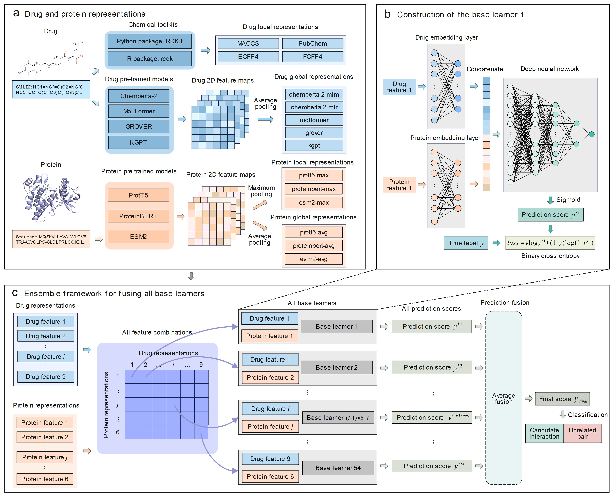

  <h3 align="center" style="font-size: 40px;">A scalable and robust ensemble deep learning method for predicting drug-target interactions</h3>
  

In this study, we propose EDeepDTI, an ensemble deep learning framework designed to enhance the generalization of DTI predictions. Additionally, we propose two model variants with different input features (EDeepDTI-d and EDeepDTI-s) to demonstrate the feature robustness of EDeepDTI, and three variants extended to other biological prediction tasks (EDeepDDI, EDeepPPI, and EDeepMDA) to showcase its scalability. EDeepDTI utilizes several pre-trained models to learn rich structural and semantic representations of drugs and proteins. Independent deep learning base learners are trained on these features, and their predictions are aggregated to produce the final output.
  

# Content
- [Environment](#Environment)
- [Usage](#Usage)
- [Code and data](#Code-and-data)
  - [Raw data](#Raw-data)
  - [Process of datasets](#Process-of-datasets)
  - [Calculation of feature](#Calculation-of-feature)
  - [Case Study](#Case-Study)
- [Other biological association prediction tasks](#Other-biological-association-prediction-tasks)
- [Citation](#Citation)
- [Supplement](#Supplement)

## Environment
python = 3.8.19 
cudatoolkit = 11.8.0 
cudnn = 8.9.2.26 
pytorch = 2.2.2 
scikit-learn = 1.3.0 
pandas = 2.0.3 
numpy = 1.24.3 
sqlalchemy = 2.0.30 

## Usage
- Run `EDeepDTI.py` for DrugBank dataset, run `EDeepDTI_CPI.py` for CPI dataset, run `EDeepDTI_Davis_KIBA.py` for Davis and KIBA datasets  
- For EDeepDTI, input_type = 'e'; for EDeepDTI-d, input_type = 'd'; for EDeepDTI-s, input_type = 's'. 
- For prediction task SR, predict_type = '5_fold'; for task SD, predict_type = 'new_drug'; for task SP, predict_type = 'new_protein'; for task SDP, predict_type = 'new_drug_protein'. 
- In `metric_test.py`, Run 'Get_metric()' to obtain the prediction results of EDeepDTI (or EDeepDTI-d, EDeepDTI-s). Run 'Get_metric_all()' to get the individual prediction results of all base learners and calculate the average and maximum AUC and AUPR of all base learners.
- For grid search for hyperparameters, run `EDeepDTI_GridSearchCV.py` to determine the values of hyperparameters (`EDeepDTI_e_all_records.csv`), run `EDeepDTI_GridSearchCV_epoch.py` to determine the number of epochs (`EDeepDTI_e_all_records_epochs.csv`). 
- Run `EDeepDTI_10fold.py` to get the prediction scores of all drug-protein pairs on the DrugBank dataset.

## Code-and-data
###  Raw-data
(datasets_DTI/origin_data)  
 * BingdingDB 
`BdingdingDB_ALl_202401.tsv` (compound-protein binding affinity) were downloaded from 'https://www.bindingdb.org/rwd/bind/chemsearch/marvin/Download.jsp'. 
 * ChEMBL  
(1) `ChEMBL_activity/1.csv, 2.csv, ..., 14.csv` (compound-protein binding affinity) were downloaded from 'https://www.ebi.ac.uk/chembl/web_components/explore/activities/' and named as 1,2,...,14.csv;  
(2) `Drug Mechanisms.tsv` (drug-target interactions for case study) were downloaded from 'https://www.ebi.ac.uk/chembl/web_components/explore/drug_mechanisms/';  
(3) `ChEMBL_target.csv` (ChEMBL-UniProt id map and target infomation) were downloaded from 'https://www.ebi.ac.uk/chembl/web_components/explore/targets/';  
(4) `src1src2.txt` (ChEMBL-DrugBank id map), `src1src22.txt` (ChEMBL-PubChem Compounds id map), `src2src22.txt` (DrugBank-PubChem Compounds) were downloaded from UniChem 2.0 'https://ftp.ebi.ac.uk/pub/databases/chembl/UniChem/data/wholeSourceMapping/'. 
 * DrugBank 
(1) `DrugBank_DTI.csv` (drug-target interactions for DrugBank dataset) were downloaded from 'https://go.drugbank.com/releases/latest#protein-identifiers';  
(2) `full database.xml` (drug-drug interactions) were downloaded from 'https://go.drugbank.com/releases/latest#full';  
(3) `structure links.csv` (Drug SMILES, DrugBank id map with other databases) were downloaded from 'https://go.drugbank.com/releases/latest#structures'. 
 * QuickGO 
`MF.tsv`,`BP.tsv`, and `CC.tsv` (protein-GO term associations) were downloaded from 'https://www.ebi.ac.uk/QuickGO/' (QuickGO browser). 
- STRING 
`9606.protein.links.full.v12.0_STRING.txt` (human protein-protein interactions) were downloaded from 'https://cn.string-db.org/cgi/download?sessionId=bq0JfjmKDFZ5&species_text=Homo+sapiens'.
 * Uniprot 
(1) `uniprotkb_reviewed_2024_02_22.tsv` (protein amino acid sequences) were downloaded from 'https://www.uniprot.org/uniprotkb?query=reviewed%3Atrue&facets=model_organism%3A9606%2Creviewed%3Atrue'; 
(2)`uniprot_string_map.tsv` (UniProt-STRING id map) were obtained from 'https://www.uniprot.org/id-mapping'. 
 * KEGG (case study/) 
`KEGG_DTI.txt` (drug-target interactions for case study) were downloaded from 'https://www.genome.jp/brite/br08906'. 

###  Process-of-datasets 
(datasets_DTI/)  
 We placed the useful data obtained from the raw data in the 'datasets_DTI/processed_data' folder and the final generated dataset and its features in the 'datasets_DTI/datasets' folder. 
 * Run `Get_DDI.R` to get drug-drug interactions from `full database.xml`.

 * The detailed steps to obtain positive samples of the DrugBank dataset and positive and negative samples of the CPI dataset are as follows:  
In `main_data.py`. 
（1）Run 'get_drugbank_dti()' to get known DTIs from the DrugBank dataset; run 'filter_drugbank_dti()' to filter the DrugBank dataset with the required drugs and proteins. 
（2）Run 'get_cpi()' to get all CPI activity data from the ChEMBL and BindingDB databases; run 'get_P_N()' to get positive and negative samples of the CPI dataset according to the threshold. 
（3）Run 'get_info()' to get PubChem compound info with unique Canonical SMILES (Molecular Weight < 1000) and UniProt protein info with unique sequences; run get_GO_PPI() to get human PPI data and protein-GO term data. 
（4）Run 'filter_cpi()' to filter the CPI dataset with the required drugs and proteins. 
（5）Run 'filter_cpi_with_bi_compound_protein()' to filter the CPI dataset by ensuring that each compound and protein is present in both positive and negative samples, and get the CPI-extra set for the SD, SP, and SDP tasks. 

 * The detailed steps to generate training, validation, and testing sets for the DrugBank and CPI datasets are as follows:  
（1）In `DTI_datasets_splict.py`, run 'get_DTI_P_N()' to select negative samples for DrugBank dataset, run 'splict_train_valid_test_DTI(type)' to get the training, validation, and testing sets for the SR, SD, SP, and SDP tasks on the DrugBank dataset. 
（2）In `CPI_datasets_splict.py`, run 'splict_train_valid_test_CPI(type)' to get the training, validation, and testing sets for the SR, SD, SP, and SDP tasks on the CPI dataset. 

### Calculation-of-feature
For the runtime environment of all pre-trained models and to download the pre-trained models, please refer to the corresponding GitHub URL or the relevant paper.

#### Features generated by the drug pre-trained models (1_drug_repre/)  
 * GROVER (grover/)  
（1）Run `get_grover_feature.py` to generate drug GROVER atoms and bonds features for DrugBank, CPI, Davis, and KIBA datasets.  
（2）For selecting between max pooling and average pooling, refer to lines 320 and 321 in `grover/model/models.py`. If you obtain the code from the original GitHub repository, line 108 in `grover/model/layers.py` also needs modification.  
（3）Run `get_grover_feature_for_DDI.py` to generate drug GROVER atoms and bonds features for DDI dataset.
 * Chemberta-2 (ChemBERTa/)    
（1）Run `get_chembert_a_features.py` to generate drug Chemberta-2 features for DrugBank, CPI, Davis, and KIBA datasets.
（2）Run `get_chembert_a_features_DDI_dataset.py` to generate drug Chemberta-2 features for DDI dataset.
 * MoLFormer (molformer/notebooks/pretrained_molformer/)  
（1）Run `get_molformer_features.py` to generate drug MoLFormer features for DrugBank, CPI, Davis, and KIBA datasets.
（2）Run `get_molformer_features_DDI.py` to generate drug MoLFormer features for DDI dataset.

#### Features generated by the protein pre-trained models (1_protein_repre/)  
 * TAPE (tape/)  
（1）Run `embedding-tape.py` to generate protein TAPE features for DrugBank, CPI, Davis, and KIBA datasets.
（2）Run `embedding_for_PPI.py` to generate protein TAPE features for PPI dataset.
 * ProteinBERT (protein_bert/)  
（1）Run `embedding_proteins_protein_bert.py` to generate protein ProteinBERT features for DrugBank, CPI, Davis, and KIBA datasets.
（2）Run `embedding_for_PPI.py` to generate protein ProteinBERT features for PPI dataset.
 * ProtTrans (ProtTrans/)  
（1）Run `embedding_proteins.py` to generate protein ProtTrans features for DrugBank, CPI, Davis, and KIBA datasets.
（2）Run `embedding_for_PPI_protrans.py` to generate protein ProtTrans features for PPI dataset.
 * ESM2 (ESM2/)  
（1）Run `embedding_proteins_esm.py` to generate protein ESM2 features for DrugBank, CPI, Davis, and KIBA datasets.
（2）Run `embedding_proteins_ems_for_PPI.py` to generate protein ESM2 features for PPI dataset.

####  EDeepDTI-d (datasets_DTI/)  
（1）Run `cal_drug_structure.py` to calculate the MACCS, RDKit, ECFP4, and FCFP4 fingerprints for DrugBank, CPI, Davis, and KIBA dataset. 
（2）Run `cal_finger&get_fasta_need.R` to calculate the PubChem fingerprint for DrugBank, CPI, Davis, and KIBA dataset. 
（3）Run `cal_finger&get_fasta_need.R` to get '.fasta' format data of proteins. 
（4）Use the open-source platform 'iLearnPlus' to calculate the protein sequence descriptors: TPC, CKSAAP, KSCTriad, PAAC, and CTD (CTDC, CTDT, CTDD). 

####  EDeepDTI-s (datasets_DTI/)  
（1）In `cal_feature_sim.py`, run 'cal_finger_sim(data_types)' to calculate Jaccard similarity measures of five molecular fingerprints for DrugBank, Davis, and KIBA datasets; run 'cal_DDI_sim()' to calculate Jaccard similarity measures of DDIs for DrugBank dataset; run 'cal_PPI_sim(data_types)' to calculate Jaccard similarity measures of PPIs, and the topological similarities of the human PPI network for DrugBank, CPI, Davis, and KIBA datasets. 
（2）Run `cal_GO_seq_sim.R` to calculate protein sequence similarity and three types of GO semantic similarities for DrugBank, CPI, Davis, and KIBA datasets. 

### Other-biological-association-prediction-tasks  
 * DDI prediction  
（1）Run `datasets_for_DDI/Trans_DeepDDI_dataset.py` to map SMILES list to DrugBank id list.  
（2）Run `EDeepDTI_for_DDI.py` to predict DDIs on the DeepDDI dataset.  
 * PPI prediction  
（1）Run `datasets_for_PPI/get_dataset.py` to get training, validation, and testing sets of S.cerevisiae dataset.  
（2）Run `EDeepDTI_for_PPI.py` to predict PPIs on the S.cerevisiae dataset. 
 * MDA prediction  
（1）Run `datasets_for_MDA/get_train_valid_test.py` to get training, validation, and testing sets of S.cerevisiae dataset.  
（2）Run `EDeepDTI_for_MDA.py` to predict MDAs on the MDA dataset. 

### Case-Study 
####  Analysis of prediction scores (case study/)
（1）Run `EDeepDTI_10fold.py.py` to get the scores for all drug-protein pairs in the DrugBank dataset. 
（2）Run `Get_KEGG_ChEMBl_DTI.py` to get DTIs from ChEMBL and KEGG databases, and retain only the DTIs between drugs and proteins that exist in the DrugBank dataset. 
（3）Run `analysis_scores_from_KEGG_ChEMBL.py` to obtain the distribution of prediction scores for all unknown drug-protein pairs and the distribution of prediction scores for DTIs from the KEGG and ChEMBL databases.
####  Molecular docking (docker/)
（1）Get protein pdb files from Protein Data Bank (PDB) database ('https://www.rcsb.org/') . 
（2）Get protein pdbqt files with PyMOL and MGLTools (proteins_pdbqt/). 
（3）Run `get_drug_pdb.py` to get drug pdbqt files (drug_pdbqt/). 
（4）Run `get_top_end_10drugs.py` to get top 10 and bottom 10 predicted drugs, and known interacting drugs of selected proteins. 
（5）Run `main_dock.py` to perform batch docking of drugs with proteins based on Autodock Vina, and save the docking results (result_pdbqt/ and result_pdbqt_fixed/) and log files (result_log/). 
（6）Run `show_results.py` to get binding affinities (affinity/). 
（7）Get interaction types using the Protein-Ligand Interaction Profiler (PLIP) (complexes/*.pse). 

## Citation

## Supplement
Some data are too large (such as the features of compounds in the CPI dataset), so this part of the data is not directly available in this GitHub repository. You can generate it using the code we provide.  
If you have any questions, please contact 6191611021@stu.jiangnan.edu.cn
